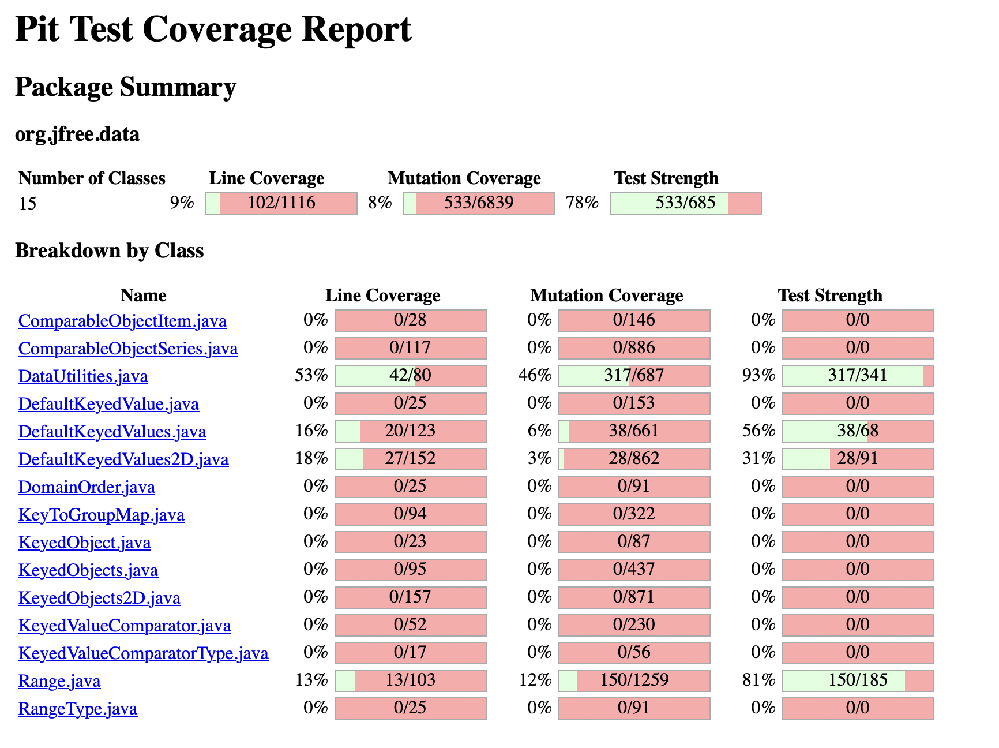

**SENG 438 - Software Testing, Reliability, and Quality**

**Lab. Report \#4 – Mutation Testing and Web app testing**

| Group \#:      | 16                        |
| -------------- | ------------------------- |
| Student Names: | Dominic Choi              |
|                | Angelo Jerome T. Reynante |
|                | Nathan Ante               |
|                | Karam Baroud              |

# Introduction

# Analysis of 10 Mutants of the Range class 
| Mutation Number | Method | Mutation | Killed/Survived | How the Mutation Was Killed or Not by Original Test Suite |
|-----------------|--------|----------|--------|-----------------------------------------------------------|
| 1               | getUpperBound | Incremented (a++) double field upper | SURVIVED | Survived because we need to try calling getUpperBound 2 times in a row |
| 2               | getUpperBound | Incremented (++a) double field upper | KILLED | Killed because operator is pre-increment and change to upper is immediate |
| 3               | getLowerBound | Incremented (a++) double field lower | SURVIVED | Survived because we need to try calling getLowerBound 2 times in a row |
| 4               | getLength       | Decremented (a--) double field lower         | SURVIVED       | Survived because we need to try calling the getLength 2 times in a row                                                          |
| 5               | getLowerBound | Decremented (--a) double field lower|KILLED| Killed because operator is pre-decrement and change to lower is immediate |
| 6               | getLength       | Decremented (a--) double field upper         | SURVIVED       | Survived because we need to try calling the getLength 2 times in a row                                                          |
| 7               | getLength       | Decremented (--a) double field lower         | KILLED       | Killed because operator is pre-decrement and change to lower is immediate                                                          |
| 8               | contains | negated conditional | KILLED | Killed because assertions will detect negation of condition |
| 9               | getCentralValue       | Decremented (a--) double field lower         | SURVIVED       | Survived because we need to try calling getCentralValue 2 times in a row                                                          |
| 10              | getCentralValue       | Decremented (a--) double field upper         | SURVIVED       | Survived because we need to try calling getCentralValue 2 times in a row                                                         |

# Equivalent Mutants

| Class Name       | Equivalent Mutant 1 | Equivalent Mutant 2 | Equivalent Mutant 3 | Equivalent Mutant 4 |
|------------------|---------------------|---------------------|---------------------|---------------------|
| Range            | Range.init: remove call to java/lang/StringBuilder::append at line 92                  | contains: Incremented (a++) double local variable number 1| Range.constrain: Incremented (a++) double local variable number 3 in line 197 | Range.getCentralValue: Replaced Double Division with Multiplication in line 132                   | Range.contains: replaced comparison checked with true in line 144
| DataUtilities    | DataUtilities.clone: Less than to not equal in line 104 | DatatUtilities.equal: Returns integer size value with (x == 0 ? 1: 0) in line 76| DataUtilities.equal: Subsitute 0 with 1 in line 82                   | DataUtilities.CalculateColumnTotal: Subsitute 0.0 with 1.0 in line 125                   |

# Report all the statistics and the mutation score for each test class

Mutation score formula = ( mutations killed / total mutations ) * 100

**Mutation score for DataUtilities = 46%**  
**Mutation score for Range = 12%**  

# Analysis drawn on the effectiveness of each of the test classes

# A discussion on the effect of equivalent mutants on mutation score accuracy

Manually detected equivalent Mutants
| Mutation Number | Method | Mutation | Killed/Survived | How the Mutation Was Killed or Not by Original Test Suite |
|-----------------|--------|----------|--------|-----------------------------------------------------------|
| 1               |  |  | SURVIVED | Survived the method is 1 line and the effect of the mutant cannot be discovered. |

Process for finding equivalent mutants:

# A discussion of what could have been done to improve the mutation score of the test suites

# Why do we need mutation testing? Advantages and disadvantages of mutation testing

# Explain your SELENUIM test case design process

# Explain the use of assertions and checkpoints

# how did you test each functionaity with different test data

# Discuss advantages and disadvantages of Selenium vs. Sikulix

# How the team work/effort was divided and managed

# Difficulties encountered, challenges overcome, and lessons learned
We were having difficulties with using the Pitest. For this reason, it depends on which java version you're using. I know some of my team members are using Java 1.8 while others are using Java 1.6. 

# Comments/feedback on the lab itself
